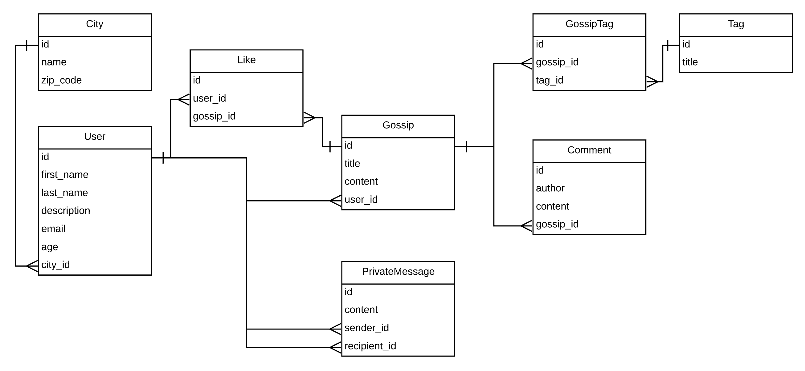

<h1>The Gossip Project 💻</h1>

The Gossip Project amélioré tout au long d'une semaine.

* Ruby version 2.5.1
* Rails version 5.2.3
* `bundle install`
* `rails db:create`
* `rails db:migrate`
* `rails db:seed`
* `rails server`
* rendez-vous sur `http://localhost:3000/` pour tester tout ça...

<h2>Tables</h2>

Les différentes tables : 
* `users` : tous nos utilisateurs
* `cities` : chaque utilisateur est lié à une ville
* `gossips` : chaque gossip est lié à un utilisateur
* `tags` : un gossip peut avoir plusieurs tags
* `gossip_tags` : table qui lie gossips et tags
* `comments` : commentaires qui appartiennent à un gossip
* `likes` : un user peut liker un (ou plusieurs) gossip puis unliker
* `private_messages` : contenu envoyé par un utilisateur à un (ou plusieurs) autre utilisateur

<h2>Architecture</h2>

<h2>Améliorations possibles</h2>

* Page pour modifier les infos d'un user quand il est connecté
* un formulaire de contact qui envoie les infos par mail
* pouvoir classer les gossips affichés sur index par tags
* ...

--------

Fait par [Ladislas](https://github.com/ladislasfontaine) 🤙 en utilisant les ressources de [The Hacking Project](https://www.thehackingproject.org)
